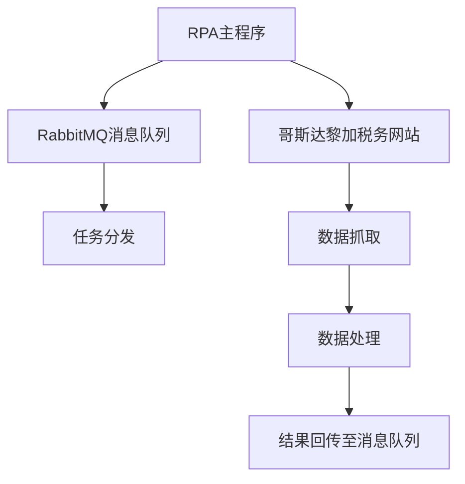
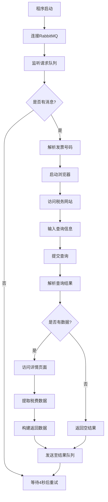

# 跨境税单RPA机器人

## 项目概述

这是一个基于Python的自动化机器人（RPA），用于从哥斯达黎加税务系统网站自动抓取跨境税单信息。该机器人通过模拟浏览器操作，自动查询并提取发票相关的税务数据。

## 功能特性

1. **自动化浏览器操作**：使用DrissionPage库模拟真实用户操作浏览器
2. **消息队列集成**：通过RabbitMQ接收待处理的发票号码任务
3. **数据提取与结构化**：自动提取税单中的各类税费信息并结构化处理
4. **异常处理机制**：完善的错误处理和日志记录功能
5. **结果回传**：将提取的数据通过消息队列返回给调用方

## 系统架构



## 核心模块说明

### 1. 配置管理模块

```python
def baseConfig(divide, key):
    yaml_config = anyconfig.load('./element_kuajing.yaml', ac_parser="yaml", encodings='gbk')
    return yaml_config.get(divide).get(key)
```

- 从[element_kuajing.yaml](file:///Users/qiyuzheng/Desktop/python_project/RPA_mafang/element_kuajing.yaml)配置文件加载系统参数
- 支持多环境配置管理

### 2. 消息队列模块

#### 2.1 获取待处理消息
```python
def get_release_messages(channel):
    # 从RabbitMQ队列中获取待处理的发票号码
```

#### 2.2 建立连接
```python
def establish_connection():
    # 建立与RabbitMQ的连接并处理消息
```

### 3. 浏览器自动化模块

#### 3.1 主流程控制
```python
def CR(channel, msg):
    # 控制整个浏览器操作流程
```

#### 3.2 数据提取
```python
def fetch_bill_of_lading_data(page, channel, invoiceNo):
    # 从税单详情页面提取各类税费数据
```

### 4. 辅助功能模块

#### 4.1 随机休眠
```python
def randomSleep():
    # 添加随机休眠时间，模拟人工操作
```

#### 4.2 表格行数统计
```python
def trNum(ele):
    # 统计表格中的行数
```

## 配置文件说明

### element_kuajing.yaml

```yaml
config:
  mq_ip: 192.168.3.18              # RabbitMQ服务器IP地址
  mq_vhost: edi_exchange           # RabbitMQ虚拟主机
  mq_port: 5672                    # RabbitMQ端口号
  queue_name: taxes.request.queue  # 请求队列名称
  mq_user: edi_exchange            # RabbitMQ用户名
  mq_password: Edi@0729#exchange   # RabbitMQ密码
  headless: false                  # 是否启用无头模式
```

## 数据结构

### 输入消息格式
```json
{
  "invoiceNo": "发票号码"
}
```

### 输出消息格式
```json
{
  "invoiceNo": "发票号码",
  "invoiceResult": {
    "arancelarios": "进口关税金额",
    "sobre": "增值税金额",
    "selectivo": "选择性消费税金额",
    "procomer": "PROCOMER费用",
    "archivo": "国家档案馆印花税",
    "asociacion": "海关代理协会印花税",
    "contadores": "私人会计师印花税",
    "Ley6946": "6946号法律费用"
  }
}
```

## 工作流程



## 依赖库

- `DrissionPage`: 浏览器自动化操作
- `pika`: RabbitMQ消息队列客户端
- `anyconfig`: 配置文件管理
- `loguru`: 日志记录
- `requests`: HTTP请求处理

## 部署要求

### 环境依赖

- Python 3.7+
- Chrome浏览器或Chromium浏览器
- RabbitMQ服务器

### 安装步骤

1. 克隆项目代码:
```bash
git clone <项目地址>
cd RPA_mafang
```

2. 安装依赖:
```bash
pip install -r requirements.txt
```

3. 配置[element_kuajing.yaml](file:///Users/qiyuzheng/Desktop/python_project/RPA_mafang/element_kuajing.yaml)文件中的RabbitMQ连接参数

4. 启动程序:
```bash
python kuajing.py
```

## 日志管理

程序使用`loguru`进行日志记录，默认将日志保存在`跨境-logs/`目录下，按日期分割日志文件，每个文件最大1000MB。

## 错误处理

1. **网络异常**: 自动重试机制
2. **元素定位失败**: 记录错误并返回空结果
3. **数据解析异常**: 捕获异常并记录详细日志
4. **消息队列异常**: 保证消息确认机制

## 扩展性说明

系统采用模块化设计，易于扩展:

1. 可以轻松添加新的税费类型提取
2. 可以修改数据提取逻辑
3. 可以增加新的数据验证规则
4. 可以自定义结果处理方式

## 维护建议

1. 定期检查RabbitMQ连接配置
2. 监控日志文件大小和内容
3. 根据网站变化调整元素定位策略
4. 定期更新浏览器驱动程序
5. pip install -r requirements.txt